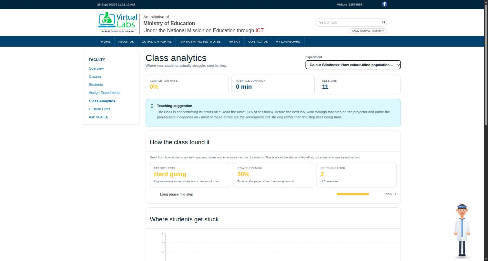
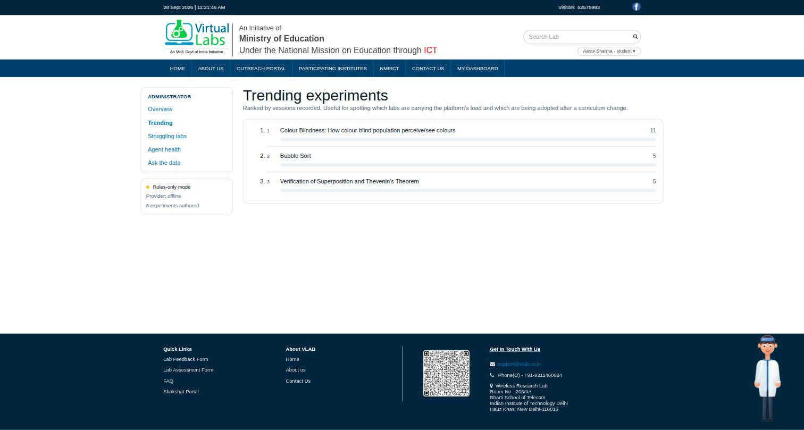
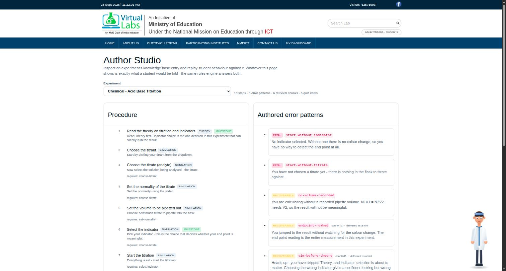

# VLAILA - Virtual Labs AI Lab Assistant

A proactive, experiment-grounded lab assistant for [Virtual Labs](https://www.vlab.co.in) - the
Ministry of Education initiative that gives students across India free, browser-based simulation
labs.

VLAILA watches a student work through an experiment, notices when they go out of order or skip a
prerequisite, and says something - once, briefly, and only when it is worth interrupting for. It
answers questions grounded in that experiment's own material, writes a reflection at the end, and
feeds anonymous aggregates to instructor and administrator dashboards.

**Integration is one line of HTML.**

```html
<script src="https://vlaila.vlabs.ac.in/vlaila.js" defer></script>
```

No configuration. The widget reads the lab, experiment, discipline, institute and current step
from metadata every Virtual Labs page already publishes.

---

| Class analytics | Trending labs | Author Studio |
|:---:|:---:|:---:|
|  |  |  |

Captured against a local API seeded with 21 synthetic sessions, running on
SQLite with the offline reasoning tier - no key, no network.

## Why one line is enough

`vlab.co.in` is a directory; the ~200 actual labs each live on their own subdomain
(`pp-iiith.vlabs.ac.in`, `de-iitr.vlabs.ac.in`, …) and are generated from one shared static
template. Every experiment page on every lab exposes the same markers:

| Signal                                      | Where                                              |
| ------------------------------------------- | -------------------------------------------------- |
| Lab, discipline, institute, experiment name | `window.dataLayer[0]`                              |
| Experiment slug                             | `<meta name="experiment-short-name">`              |
| **Current step**                            | `<meta name="task-name">`                          |
| **Simulator DOM**                           | `iframe#fraDisabled` - same-origin, fully readable |

Verified against labs in three different disciplines from three different institutes. Because the
template is shared, adding the script tag upstream covers every lab on the platform in a single
commit. See [`docs/PLATFORM_AUDIT.md`](docs/PLATFORM_AUDIT.md).

---

## Run it

Nothing here needs an API key. With no credentials the assistant runs on its deterministic rules
engine and composes answers from the knowledge base - degraded, never down.

```bash
# 1. API  (SQLite + offline reasoning)
python3 -m venv .venv && .venv/bin/pip install -r server/requirements.txt
cd server && ../.venv/bin/uvicorn app.main:app --port 8000

# 2. Widget
cd embed && npm install && npm run build

# 3. A replica Virtual Labs experiment page to try it on
python3 -m http.server 4173      # then open /embed/demo/simulation.html

# 4. Console (instructor + admin dashboards, Author Studio)
npm install && npm run dev
```

Or the whole stack:

```bash
docker compose up
```

To turn on the model tier, set two variables - nothing else changes:

```bash
export VLAILA_LLM_PROVIDER=anthropic
export VLAILA_ANTHROPIC_API_KEY=sk-ant-...
```

For a fully on-premise deployment where no session data leaves the network, use
`VLAILA_LLM_PROVIDER=ollama` instead.

---

## How it decides

Every observed interaction walks down a four-tier ladder and stops at the first tier that can
answer confidently.

| Tier               | Runs                   | Latency | Handles                                                          |
| ------------------ | ---------------------- | ------- | ---------------------------------------------------------------- |
| 0 · Detector       | Browser                | ~0 ms   | Which experiment, which step, what was touched                   |
| 1 · Rules engine   | Browser **and** server | <5 ms   | Prerequisite violations, out-of-order steps, out-of-range values |
| 2 · Small model    | Ollama / self-hosted   | ~300 ms | Ambiguous classification                                         |
| 3 · Frontier model | Claude API             | ~1.2 s  | Conceptual Q&A, summaries, quizzes, NL→SQL                       |

Most interventions never leave Tier 1. Detecting that a student clicked _Run_ before setting the
voltage is a deterministic problem: the knowledge base already encodes the correct order and the
valid ranges. Spending a model call to rediscover that costs money and puts a second of latency
into the exact moment learning flow matters most.

Tier 1 is implemented twice - `server/app/agent/rules.py` and `embed/src/rules.ts` - with matching
semantics, so the browser keeps validating steps with no network at all.

---

## Repository

```
docs/      Plan, architecture, platform audit, KB authoring guide, deliverables map
kb/        JSON Schema + 6 authored experiments across 5 disciplines + validator
server/    FastAPI: agent core, rules, session memory, RAG, analytics, NL→SQL, exports
embed/     The widget → dist/vlaila.js (Shadow DOM, ~20 kB gzipped, offline-capable)
src/       VLAILA Console - instructor/admin dashboards, Author Studio
```

## Access control

The student-facing routes (`/session/*`, `/chat*`, the knowledge base catalogue)
are open. They have to be: the widget is embedded in ~200 independently hosted
lab pages and has no identity to present. They are rate limited per session
instead.

The instructor and admin surfaces are not. `/instructor/students` returns
per-student rows with a behavioural flag on each, `/admin/query` runs
natural-language queries over the session store and `/admin/export` dumps it, so
they require a credential:

```bash
VLAILA_STAFF_API_KEY=$(openssl rand -hex 24)   # in server/.env
curl -H "X-API-Key: $VLAILA_STAFF_API_KEY" localhost:8000/instructor/students?experiment_id=colour-blindness
```

It fails closed. With no key set, the staff routes return 503 telling you which
variable to set rather than serving anyone. For local work:

```bash
VLAILA_ALLOW_UNAUTHENTICATED_STAFF=true
```

The console reads the key from `localStorage.vlaila_staff_key` (or an injected
`window.__VLAILA_STAFF_KEY__`), deliberately not from a `VITE_` variable -
anything with that prefix is inlined into the built bundle, so the key would
ship to every visitor.

## Tests

```bash
.venv/bin/python -m pytest server/tests -q     # 53 tests
.venv/bin/python kb/validate.py                # knowledge base integrity
cd embed && npx tsc --noEmit                   # widget typecheck
```

The backend suite includes the 20-case agent evaluation suite. More than a third of those cases
assert the agent stays **silent** - it is easy to build something that catches every error and
impossible to trust something that also fires on students doing everything right.

---

## Design principles

1. **Ambient, not attentional.** Success is a student who finishes and barely noticed it was there.
2. **Never wrong, sometimes quiet.** A false warning costs more trust than a missed hint costs
   learning. Below 90% confidence, a warning is delivered as a hint instead.
3. **Works when nothing else does.** No key, no GPU, no connectivity - step validation still runs.
4. **Zero friction to adopt.** One script tag, no lab code changes, no student login.
5. **Privacy by construction.** Anonymous by default; nothing identifying ever reaches a model.
6. **Explain, don't answer.** It will teach the concept behind a posttest question. It will not
   hand over the answer.

Licensed AGPL-3.0 / CC BY-NC-SA 4.0, matching the Virtual Labs platform.
